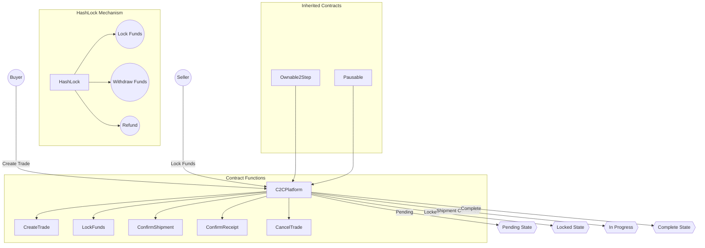

# Early stage construction........

# LibMarket

Aims to build an open e-commerce platform based on Web3, with equality, reasonable distribution, free communication and pricing, and adopting a CtoC model. You can sell paintings (physical), flowers, concert tickets, clothes and any other items here!!

-----------------------------

ing

Sample Contract Monomer Model...

